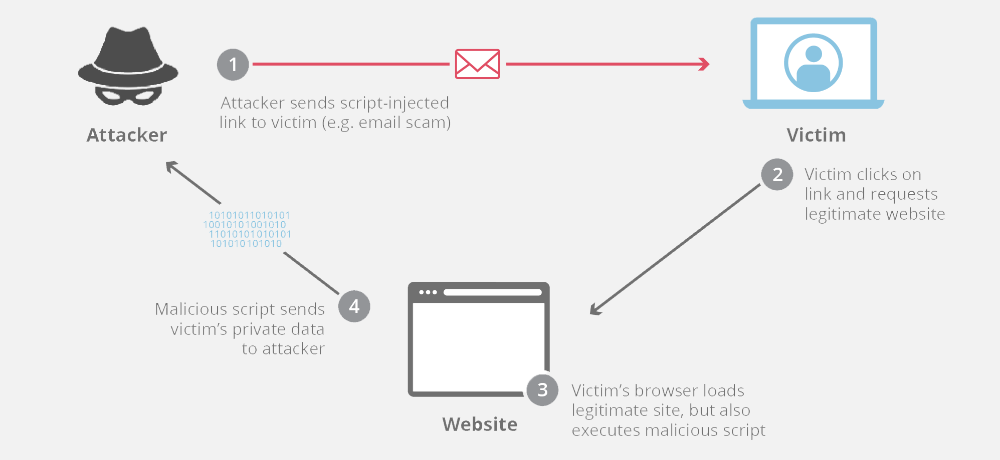

XSS: Cross-site scripting



attacker attachs code (JS code) onto a validated website on victim's browser
<br>
=> script run with authority => send private data back to attacker

Example: A website have unvalidated comment forums. In this case, an attacker will post a comment consisting of executable code wrapped in <script></script> tags. Once that comment is on page, when any other user loads that website, the malicious code will be executed by their web browser => they will become a victim

Harms:
- JavaScript has access to cookies*, and an attacker could use an XSS attack to steal a user’s cookies and impersonate them online.
- JavaScript can also create HTTP requests, which can be used to send data (such as stolen cookies) back to the attacker.
- client-side JavaScript can also help an attacker gain access to APIs that contain geolocation coordinates, webcam data, and other sensitive information

Types:
- Reflected cross-site scripting
With a reflected attack, malicious code is added onto the end of the url of a website
Ex: http://legitamite-bank.com/index.php?user=<script>here is some bad code!</script>
- Persistent cross-site scripting
This happens on sites that let users post content that other users will see, such as a comments forum or social media site, for example. If the site doesn’t properly validate the inputs for user-generated content, an attacker can insert code that other users’ browsers will execute when the page loads.
Ex:
````
    <div>
        <h1>Comment section</h1>
        <p>
            This is real comment of user <script>console.log("we can access the website!")</script>
        <p>
    </div>
````

How to prevent cross-site scripting:
- If possible, avoiding HTML in inputs - One very effective way to avoid persistent cross-site scripting attacks is to prevent users from posting HTML into form inputs. There are other options which let users create rich content without the use of HTML, such as markdown and WYSIWYG editors.
- Validating inputs - Validation means implementing rules that prevent a user from posting data into a form that doesn’t meet certain criteria. For example, an input that asks for the user’s “Last Name” should have validation rules that only let the user submit data consisting of alphanumeric characters. Validation rules can also be set to reject any tags or characters commonly used in cross-site scripting, such as “<script>” tags.
- Sanitizing data - Sanitizing data is similar to validation, but it happens after the data has already been posted to the web server, yet still before it is displayed to another user. There are several online tools that can sanitize HTML and filter out any malicious code injections.
- Taking cookie security measures - Web applications can also set special rules for their cookie handling that can mitigate cookie-theft via cross-site scripting attacks. Cookies can be tied to particular IP addresses so that cross-site scripting attackers cannot access them. Additionally, rules can be created to block JavaScript from accessing cookies altogether.
